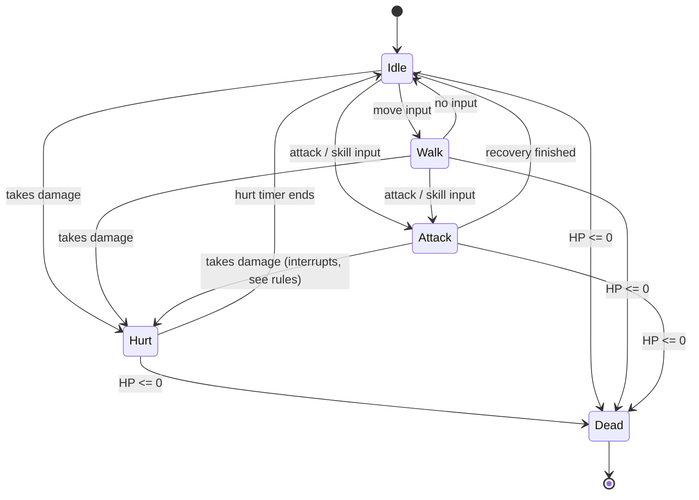

# RealmQuest: Character Design Spec

> Status: **Draft v0.1**. All numbers are starting values and will be tuned during playtesting.
> Machine-readable version: [`characters.json`](../src/data/characters.json)

## 1. Overview

RealmQuest has three playable classes, each with a distinct role, silhouette, and playstyle.

| | Warrior | Mage | Archer |
|---|---|---|---|
| **Role** | Tank / frontline | Glass cannon / area damage | Mobile ranged damage |
| **HP** | 120 (High) | 70 (Low) | 90 (Medium) |
| **Move speed** | 2 (Slow) | 3 (Medium) | 4 (Fast) |
| **Attack range** | Melee | Long | Long |
| **Resource** | Stamina (100) | Mana (100) | Stamina (100) |
| **Resource regen** | 10 / sec | 6 / sec | 12 / sec |
| **Color identity** | Red / steel | Purple / blue | Green / brown |
| **Silhouette** | Wide, heavy, big weapon | Tall, narrow, pointed hat + staff | Lean, hooded, bow + quiver |

*Move speed is in tiles per second. Range is in tiles (1 tile = 32 px).*

## 2. Skills

### Warrior

| Skill | Damage | Cooldown | Cost | Range | Description |
|---|---|---|---|---|---|
| **Slash** | 15 | 0.8 s | 0 | 1.5 | Basic melee sword swing in front of the warrior. |
| **Shield Bash** | 10 | 5 s | 20 stamina | 1.0 | Short-range hit that stuns the target for 1 s. |
| **War Cry** | 0 | 15 s | 30 stamina | Self | +25% damage for 6 s. |
| **Whirlwind** | 12 | 10 s | 40 stamina | 2.0 | Spin attack hitting all adjacent enemies. |

### Mage

| Skill | Damage | Cooldown | Cost | Range | Description |
|---|---|---|---|---|---|
| **Arcane Bolt** | 8 | 0.6 s | 0 | 6 | Fast, weak basic projectile. |
| **Fireball** | 25 | 3 s | 10 mana | 7 | Slow projectile that explodes on impact (small radius). |
| **Frost Nova** | 15 | 8 s | 25 mana | 3 (radius) | Area burst around the mage; slows enemies 40% for 3 s. |
| **Mana Shield** | 0 | 15 s | 20 mana | Self | Absorbs up to 30 damage for 10 s. |

### Archer

| Skill | Damage | Cooldown | Cost | Range | Description |
|---|---|---|---|---|---|
| **Quick Shot** | 12 | 0.6 s | 0 | 8 | Fast single arrow (basic attack). |
| **Multi-Shot** | 8 x 3 | 6 s | 20 stamina | 6 | Fires 3 arrows in a spread. |
| **Poison Arrow** | 6 + 4/s | 10 s | 25 stamina | 8 | Applies poison for 3 s. |
| **Dodge Roll** | 0 | 4 s | 15 stamina | 3 (distance) | Quick roll; invulnerable for 0.4 s. |

## 3. Behavior State Machine

All three characters share the same states. Only the attack details differ.



### Interrupt rules

| Current state | Can be interrupted by | Notes |
|---|---|---|
| Idle / Walk | Anything | Free to change state. |
| Attack (windup) | Hurt, Dead | Getting hit during windup cancels the attack. |
| Attack (strike / recovery) | Dead only | Strike and recovery cannot be canceled by normal hits. |
| Hurt | Dead | Brief stagger (0.3 s); no input accepted. |
| Dead | Nothing | Final state. |
| Dodge Roll (Archer) | Nothing | Invulnerable during the roll. |

## 4. Animation Spec

Sprite size: **32x32 per frame**, transparent background, palette shared across all characters.
Exported as a **horizontal sprite sheet** per animation, named `<character>_<animation>.png`.

| Animation | Frames | FPS | Loops? | Notes |
|---|---|---|---|---|
| idle | 7 | 6 | Yes | Subtle breathing / bob. *(Warrior idle already drawn: 7 frames.)* |
| walk | 6 | 10 | Yes | Feet must stay grounded; no drift. |
| attack | 5 | 12 | No | Windup (2), strike (1), recovery (2). |
| hurt | 2 | 10 | No | Recoil pose, then return. |
| death | 4 | 8 | No | Hold the last frame. |

### Attack timing (target)

| Phase | Frames | Duration | Purpose |
|---|---|---|---|
| Windup | 2 | ~0.17 s | Telegraphs the attack. Can be canceled by Hurt. |
| Strike | 1 | ~0.08 s | Damage is applied on this frame. |
| Recovery | 2 | ~0.17 s | Brief vulnerability before returning to idle. |

Total ≈ 0.42 s, which fits inside the 0.6 s and 0.8 s basic-attack cooldowns.

**Damage frame:** the hit/projectile spawn should trigger on the **strike frame** (frame index 2, zero-based) of every attack animation.

### Projectile sprites (separate from character sheets)

| Sprite | Size | Frames | Used by |
|---|---|---|---|
| `arrow.png` | 16x8 | 1 | Archer skills |
| `poison_arrow.png` | 16x8 | 1 | Poison Arrow |
| `arcane_bolt.png` | 8x8 | 2 | Mage basic |
| `fireball.png` | 16x16 | 4 | Mage Fireball |
| `frost_nova.png` | 64x64 | 5 | Mage Frost Nova (effect) |

## 5. Asset Checklist

| Asset | Warrior | Mage | Archer |
|---|---|---|---|
| idle | ✅ done | ⬜ | ⬜ |
| walk | ⬜ | ⬜ | ⬜ |
| attack | ⬜ | ⬜ | ⬜ |
| hurt | ⬜ | ⬜ | ⬜ |
| death | ⬜ | ⬜ | ⬜ |
| projectiles / effects | n/a | ⬜ | ⬜ |

## 6. File Naming Conventions

```
assets/characters/warrior_idle.png
assets/characters/warrior_attack.png
assets/characters/mage_idle.png
assets/characters/archer_walk.png
assets/projectiles/fireball.png
assets/source/warrior_idle.piskel     <- editable source files
```

## 7. Open Questions for the Team

- What language / engine is `src` using? (Determines how sprite sheets are loaded.)
- Is combat real-time or turn-based? (This spec assumes real-time.)
- Should the frame size stay 32x32 for enemies too?
